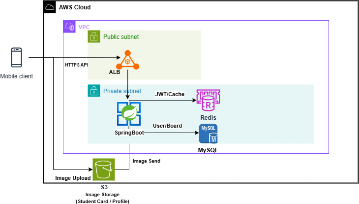

# 🌿 TeenPle(Teenage Place) — Backend

고등학생이 자신의 학교를 인증하고 참여할 수 있는  
**학교 전용 익명 커뮤니티 TeenPle**(Teenage Place)의 **백엔드 레포지토리**입니다.

본 저장소는 인증, 게시판, 채팅, 통계 등 TeenPle의 핵심 서버 기능을 담당합니다.

<div align="center">
  
</div>

---

## 📘 Development Standards

- 📄 **TeenPle 개발 표준 정의서 (PDF)**  
  👉 [Download PDF](assets/TeenPle_Development_Standards.pdf)

> 본 문서는 TeenPle 백엔드 개발 표준을 정의한 공식 문서이며,  
> 필요 시 PDF로 업데이트됩니다.

---

## 🚀 Tech Stack

### Backend


### Realtime / Auth


### Database


### Infrastructure & CI/CD


### Frontend (Mobile)


---

## 🔧 Architecture

### Backend Infrastructure Overview



> 본 아키텍처 다이어그램은 현재 초기 설계안이며,  
> 기능 확장 및 트래픽 증가에 따라 추후 수정·보완될 예정입니다.

---

## 📁 프로젝트 구조

```text
backend
├─ domain                     # 비즈니스 도메인 계층
│  └─ chatmessage             # 도메인 세분화 예시 (채팅 메시지)
│     ├─ controller           # API 요청/응답 처리
│     ├─ dto                  # Request / Response DTO
│     ├─ entity               # JPA Entity
│     ├─ exception            # 도메인 전용 예외
│     ├─ repository           # 데이터 접근 계층
│     └─ service              # 비즈니스 로직
│
├─ global                     # 전역 공통 모듈
│  ├─ apiPayload              # 공통 API 응답 / 에러 코드
│  ├─ batch                   # 배치 및 스케줄링 작업
│  ├─ common                  # 공통 유틸리티
│  ├─ config                  # 전역 설정
│  ├─ exception               # 글로벌 예외 처리
│  ├─ file                    # 파일 처리 (S3 연동)
│  ├─ firebase                # Firebase Admin 연동
│  ├─ init                    # 초기 데이터 설정
│  ├─ jwt                     # JWT 인증
│  ├─ security                # Spring Security 설정
│  ├─ swagger                 # API 문서 설정
│  └─ websocket               # WebSocket 설정
│
├─ docker                     # Docker 및 배포 관련 설정
└─ resources                  # 환경 설정 파일
```

---

## 🚀 배포 파이프라인 (CI/CD)

(추후 작성)

---

# 📌 협업 규칙

## 🌿 브랜치 전략

우리 팀은 다음과 같은 브랜치 전략을 사용합니다.

- `main` : 실제 배포용 브랜치 (프로덕션)
- `develop` : 개발 통합 브랜치
- `demo` : 시연/테스트 서버 배포용 브랜치

### 작업 브랜치 전략

이슈 단위로 브랜치를 생성하고, 작업 완료 후 `develop` 브랜치로 병합합니다.

- 기능 개발 : `feat/{이슈번호}-{간단설명}`
- 버그 수정 : `fix/{이슈번호}-{간단설명}`
- 문서/설정 : `chore/{이슈번호}-{간단설명}` 또는 `docs/{이슈번호}-{간단설명}`

예시:

- `feat/8-swagger-config`
- `fix/12-login-bug`

### 기본 워크플로우

1. 이슈 생성 (`#8 Swagger 설정` 등)
2. `develop` 기준으로 작업 브랜치 생성  
   `git checkout -b feat/8-swagger-config develop`
3. 커밋 메시지에 이슈 번호 연동  
   `feat: Swagger 세팅 및 도메인별 그룹 설정`
4. `develop` 대상으로 PR 생성
   - PR 본문에 `Resolves #8` 작성
5. 코드 리뷰 후 `develop`에 머지
6. 필요 시 `develop` → `demo`, 안정화 후 `develop` → `main` 배포

---

## 📝 커밋 컨벤션

### 1️⃣ Commit Type

| Type         | 설명                                |
| ------------ | ----------------------------------- |
| **Feat**     | 새로운 기능 추가                    |
| **Fix**      | 버그 수정                           |
| **Docs**     | 문서 수정                           |
| **Style**    | 코드 포맷팅(동작 영향 없음)         |
| **Refactor** | 코드 리팩토링                       |
| **Test**     | 테스트 코드 추가/수정               |
| **Chore**    | 기타 변경사항(빌드, 패키지 정리 등) |
| **Design**   | UI/CSS 등 디자인 관련 수정          |
| **Comment**  | 주석 추가/변경                      |
| **Init**     | 프로젝트 초기 설정                  |
| **Rename**   | 파일/폴더명 변경                    |
| **Remove**   | 파일 삭제                           |

---

### 2️⃣ Subject Rule

- 제목은 **50자 이하**
- **마침표/특수기호 X**
- 영문 시 **동사 원형**, 첫 글자 대문자
- **개조식 표현** 사용 (문장형 X)

---

### 3️⃣ Body Rule

- 한 줄 **72자 이하**
- "무엇을, 왜 변경했는지" 중심
- 양은 자유롭게 작성
- 선택이지만 가급적 작성 권장

---

### 4️⃣ Footer Rule

- 형식: `유형: #이슈번호`
- 여러 개일 경우 쉼표로 구분
- 사용 가능한 유형:

| 유형           | 설명                 |
| -------------- | -------------------- |
| **Fixes**      | 이슈 수정 중(미해결) |
| **Resolves**   | 이슈 해결            |
| **Ref**        | 참고할 이슈          |
| **Related to** | 관련된 이슈(미해결)  |

#### 예시

```
Feat: Add user signup feature

회원가입 기능 구현
JWT 기반 인증 구조 초안 작성

Resolves: #12
```

---

## 👥 Team

<table>
  <tr>
    <td align="center" width="200">
      <a href="https://github.com/hongwangki">
        
        <br><b>홍왕기</b>
      </a>
    </td>
    <td align="center" width="200">
      <a href="https://github.com/rkddk7165">
        
        <br><b>강현민</b>
      </a>
    </td>
  </tr>
</table>
